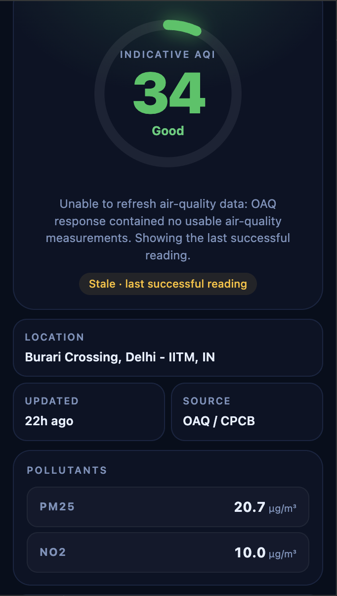
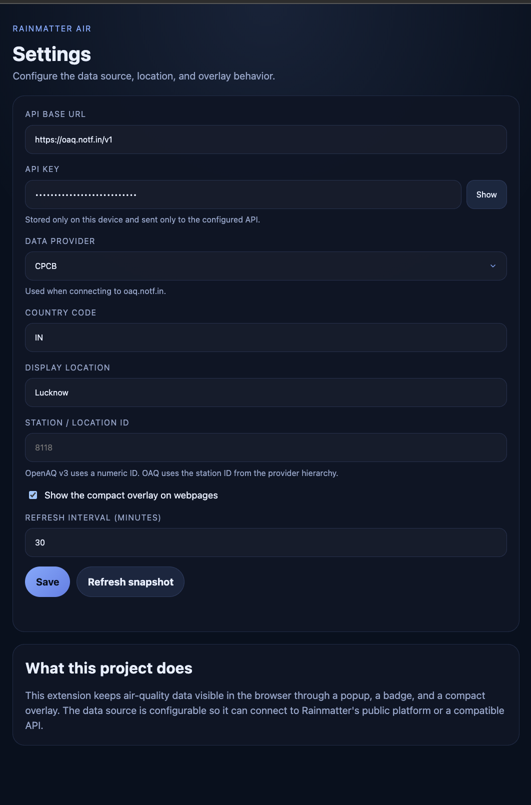
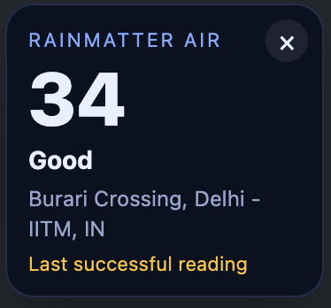

# Rainmatter Air Extension

[](LICENSE)

A Chrome extension that keeps air-quality data visible in the browser. **[→ rainmatter-air-landing.vercel.app](https://rainmatter-air-landing.vercel.app/)**

## Screenshots




## Install locally

1. Clone this repository.
2. Open `chrome://extensions` in Chrome.
3. Enable **Developer mode**.
4. Select **Load unpacked** and choose this repository.
5. Open the extension's Settings page and enter an OpenAQ API key and location ID.

## What it includes

- Popup dashboard for AQI, category, and pollutant measurements
- Options page for configuring API endpoint and location
- Background service worker that fetches and caches the latest snapshot
- Content script overlay for quick at-a-glance visibility on any webpage



## Connecting to OAQ (oaq.notf.in)

To use Rainmatter's own OAQ platform, set the following in the extension's Settings page:

- **API base URL**: `https://oaq.notf.in/v1`
- **API key**: your OAQ API key (get one at [oaq.notf.in](https://oaq.notf.in))
- **Data provider**: the provider whose network you want (e.g. `Aurassure`, `CPCB`, `Airnet`)
- **Display location**: the city name as it appears in the provider hierarchy (e.g. `Bhubaneswar`)
- **Station / location ID**: the numeric station ID (e.g. `14151`); leave blank to use the city-wide map average instead

## Data source

The extension defaults to OpenAQ API v3. OpenAQ requires an API key and a numeric
location ID; both can be entered on the extension's Settings page. The key is stored
in local extension storage (not Chrome sync) and is sent as the `X-API-Key` header only
to the configured API endpoint.

When an API does not report an AQI directly, the extension displays an indicative
AQI calculated from available pollutant measurements using CPCB breakpoints. Latest
sensor readings are not a substitute for the averaging periods required for an
official CPCB AQI.

## Check

Use Node.js 24 or newer, then run:

```bash
npm run check
```

GitHub Actions runs the same validation for pushes and pull requests and publishes
the packaged extension as a short-lived workflow artifact.

Run the end-to-end smoke test with a current Chrome for Testing or Chromium build:

```bash
npm run test:browser
```

Set `CHROME_PATH` to the browser executable when it is not installed in a standard
location:

```bash
CHROME_PATH="/path/to/chrome" npm run test:browser
```

Branded Google Chrome 137 and newer no longer supports the command-line flags used to
load unpacked extensions automatically. The smoke test therefore uses Chrome's DevTools
extension API to load this repository into Chrome for Testing or Chromium. It verifies
that the Manifest V3 service worker starts, credentials remain in local rather than
synchronized storage, the popup renders a cached snapshot, and Settings loads the saved
configuration with the API key masked.

Continuous integration installs Chrome for Testing and runs this smoke test before
building the extension package.

To verify the configured OpenAQ location against the live API, copy `.env.example`
to `.env`, add your key, and run:

```bash
npm run test:live
```

## Package

Create a Chrome Web Store-ready ZIP in `dist/`:

```bash
npm run package
```

The package uses an explicit runtime-file allowlist, so local files such as `.env`, tests,
and development scripts are excluded.

## Permissions and privacy

- `storage` saves settings and the latest snapshot.
- `alarms` schedules background refreshes.
- OpenAQ host access allows the default API connection.
- Custom API host access is optional and requested only when configured.
- HTTP/HTTPS content-script access displays the optional overlay; page content is not read or transmitted.

See [PRIVACY.md](PRIVACY.md) for the complete data-handling summary.

## Contributing

Contributions are welcome. Here is how to get started.

**Set up**

```bash
git clone https://github.com/1n4NO/rainmatter-air-extension
cd rainmatter-air-extension
node --version   # Node.js 24 or newer required
npm run check    # must pass before you open a PR
```

Load the extension in Chrome by going to `chrome://extensions`, enabling Developer mode, and choosing Load unpacked on this directory.

**Making changes**

Keep pull requests focused — one logical change per PR. For anything beyond a small bug fix, open an issue first to discuss the approach. The test suite (`npm run check`) must pass on every commit; CI will block the merge otherwise.

Core logic lives in `lib/air-quality.js` and has unit tests in `test/air-quality.test.mjs`. Add a test for every new behaviour or bug fix. The background service worker (`background.js`) handles fetch and caching; UI lives in `popup.*` and `options.*`.

**Code style**

- Vanilla JS (no build step, no bundler).
- No external runtime dependencies — keep the extension self-contained.
- Prefer `const`/`let`, `async`/`await`, and ES module syntax.
- Formatting is not enforced by a linter; just match the surrounding style.

**Commit messages**

Use the imperative mood in the subject line (`Add OAQ broker session caching`, not `Added…`). Keep the subject under 72 characters. Reference issues with `Fixes #123` in the body where relevant.

**Pull request checklist**

- `npm run check` passes locally.
- New or changed behaviour is covered by a test.
- The `PRIVACY.md` is updated if the extension gains new network access or storage keys.
- The `manifest.json` version is bumped if this change should ship as a new release.

**Reporting issues**

Open a GitHub issue with steps to reproduce, the Chrome version, and (if relevant) the API endpoint and error message. Do not include your API key.

## License

[MIT](https://github.com/1n4NO/rainmatter-air-extension/blob/main/LICENSE) © https://github.com/1n4NO
